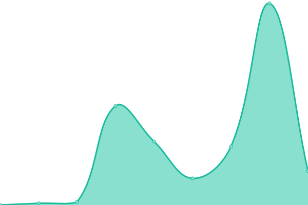

# [📈 Live Status](https://status.mingming.dev): <!--live status--> **🟧 Partial outage**

This repository contains the open-source uptime monitor and status page for [明明](https://mingming.dev), powered by [Upptime](https://github.com/upptime/upptime).

With [Upptime](https://upptime.js.org), you can get your own unlimited and free uptime monitor and status page, powered entirely by a GitHub repository. We use [Issues](https://github.com/ifyour/status/issues) as incident reports, [Actions](https://github.com/ifyour/status/actions) as uptime monitors, and [Pages](https://status.mingming.dev) for the status page.

<!--start: status pages-->
<!-- This summary is generated by Upptime (https://github.com/upptime/upptime) -->
<!-- Do not edit this manually, your changes will be overwritten -->
<!-- prettier-ignore -->
| URL | Status | History | Response Time | Uptime |
| --- | ------ | ------- | ------------- | ------ |
|  [DeepLX](https://deeplx.mingming.dev) | 🟩 Up | [deep-lx.yml](https://github.com/ifyour/status/commits/HEAD/history/deep-lx.yml) | 

 90ms
     
 | 

<a href="https://status.mingming.dev/history/deep-lx">100.00%</a>
    

|  [AdGuard](https://dns.mingming.dev) | 🟥 Down | [ad-guard.yml](https://github.com/ifyour/status/commits/HEAD/history/ad-guard.yml) | 

 173ms
     
 | 

<a href="https://status.mingming.dev/history/ad-guard">28.07%</a>
    

|  [CORS](https://cors.mingming.dev) | 🟥 Down | [cors.yml](https://github.com/ifyour/status/commits/HEAD/history/cors.yml) | 

 5574ms
     
 | 

<a href="https://status.mingming.dev/history/cors">28.07%</a>
    

|  [Image Hosting](https://images.mingming.dev) | 🟥 Down | [image-hosting.yml](https://github.com/ifyour/status/commits/HEAD/history/image-hosting.yml) | 

 5352ms
     
 | 

<a href="https://status.mingming.dev/history/image-hosting">28.07%</a>
    

|  [Vless](https://vless.mingming.dev) | 🟩 Up | [vless.yml](https://github.com/ifyour/status/commits/HEAD/history/vless.yml) | 

 86ms
     
 | 

<a href="https://status.mingming.dev/history/vless">100.00%</a>
    

|  [Blog](https://mingming.dev) | 🟩 Up | [blog.yml](https://github.com/ifyour/status/commits/HEAD/history/blog.yml) | 

 144ms
     
 | 

<a href="https://status.mingming.dev/history/blog">100.00%</a>
    

|  [Notes](https://notes.mingming.dev) | 🟥 Down | [notes.yml](https://github.com/ifyour/status/commits/HEAD/history/notes.yml) | 

 2604ms
     
 | 

<a href="https://status.mingming.dev/history/notes">28.08%</a>
    

|  [Chat](https://chat.mingming.dev) | 🟩 Up | [chat.yml](https://github.com/ifyour/status/commits/HEAD/history/chat.yml) | 

 101ms
     
 | 

<a href="https://status.mingming.dev/history/chat">100.00%</a>
    

<!--end: status pages-->

[**Visit our status website →**](https://status.mingming.dev)

## 📄 License

- Powered by: [Upptime](https://github.com/upptime/upptime)
- Code: [MIT](./LICENSE) © [明明](https://mingming.dev)
- Data in the `./history` directory: [Open Database License](https://opendatacommons.org/licenses/odbl/1-0/)
